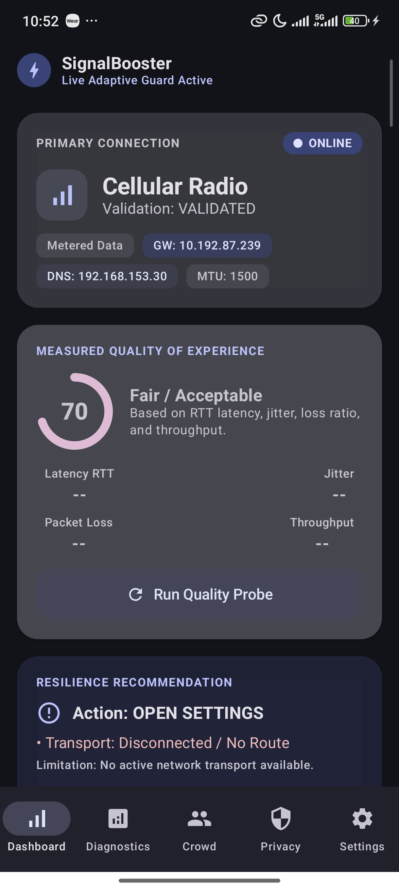
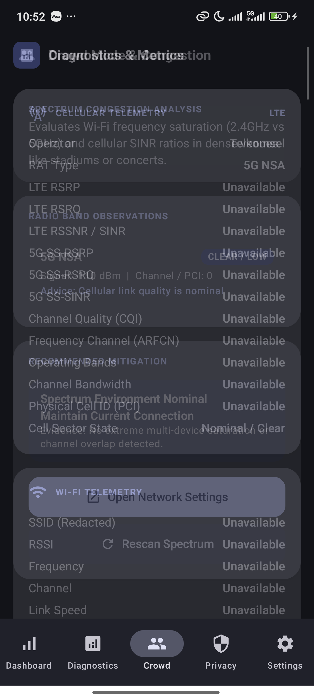
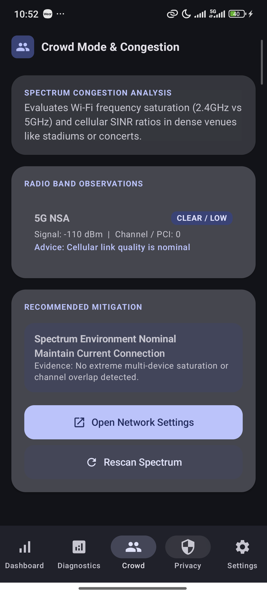
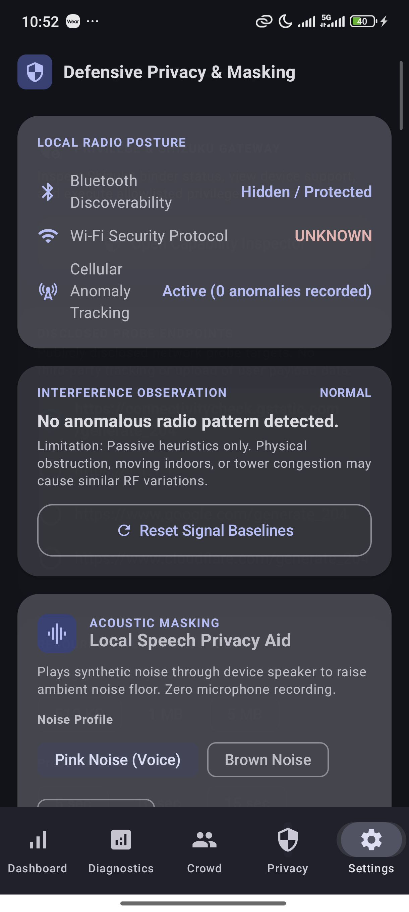
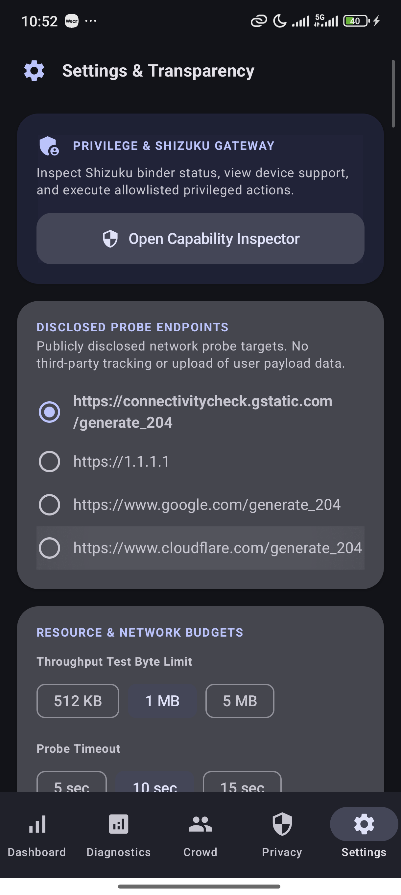

<div align="center">

# 📶 SignalBooster

**Resilient Android Connectivity Diagnostics, QoE Analysis & Privacy Resilience**

[](https://kotlinlang.org)
[-green.svg?logo=android)](https://developer.android.com)
[-green.svg?logo=android)](https://developer.android.com)
[](https://developer.android.com/jetpack/compose)
[](https://dagger.dev/hilt/)
[](https://github.com/Adrian463588/SignalBooster/actions)
[](LICENSE)

*A local-first, privacy-respecting Android application designed to diagnose network connectivity, evaluate Quality of Experience (QoE), detect signal anomalies, and provide acoustic privacy aids in congested or untrusted environments.*

---

</div>

## 📱 Live Screenshots & UI Showcase

<div align="center">

| 📊 Live QoE Dashboard | 📡 Diagnostics & Telemetry | 👥 Crowd Mode Band Analysis |
| :---: | :---: | :---: |
|  |  |  |

| 🛡️ Privacy & Acoustic Masking | ⚙️ Settings & Data Wipe | ⚡ Privilege & Capability Inspector |
| :---: | :---: | :---: |
|  |  |  |

</div>

---

## 📌 Project Overview

In congested RF environments (such as conferences, transportation hubs, campuses, and festivals), mobile devices often display high signal bar indicators (strong RSSI) while experiencing severe packet loss, captive portal dead-ends, or transport-layer stalls.

**SignalBooster** solves this by providing:
1. **Measured QoE Metrics**: Replaces misleading raw RSSI indicators with real-world Quality of Experience (latency, DNS resolution speed, jitter, and transport health) across Wi-Fi, LTE, and 5G.
2. **Resilience & Recovery**: Offers safe, public API-driven network recovery recommendations to resolve dead gateways and roaming stalls.
3. **Defensive Signal Observation**: Uses pure-Kotlin rule engines to detect sudden signal degradation and suspicious interference patterns with transparent confidence levels.
4. **Local Acoustic Masking**: Provides an on-demand, local acoustic privacy aid using synthetic sound generation (white, pink, and brown noise) with volume guardrails.

---

## 🛡️ Platform Safety & Ethical Boundary

> [!IMPORTANT]
> **Strictly Defensive by Design:**
> - **Zero RF Jamming / Disruption:** SignalBooster strictly adheres to radio communication laws and platform safety rules. It does **not** transmit radio jamming signals, inject 802.11 deauthentication frames, or disrupt third-party devices.
> - **No Unvalidated Elevated Execution:** All privileged capabilities (via Shizuku) are typed, strictly allowlisted, and require explicit user consent.
> - **Zero Telemetry / Local-Only:** All signal analysis, QoE probes, and masking execute entirely on-device. No GPS coordinates, BSSIDs, IMSIs, MAC addresses, or audio recordings are stored or uploaded.

---

## ✨ Key Features

- 📊 **Real-Time Connectivity Stabilizer**: Live monitoring of default network capabilities, transport type (Wi-Fi, Cellular, VPN), validation status, Gateway IP, DNS servers, and MTU link properties with isolated gateway stall detection.
- ⏱️ **Adaptive Keep-Alive Engine**: Low-overhead connection heartbeat with bounded exponential backoff intervals (`1s -> 2s -> 4s -> 8s -> 15s -> 30s`), preventing TCP idle timeouts without artificial traffic loops.
- 🔄 **9-Stage Reconnection State Machine**: Hysteresis-governed recovery coordinator (`HEALTHY -> DEGRADED -> VERIFYING -> RECOVERING -> VALIDATING`) with 30s dwell time to prevent oscillating network flips and dual-SIM `EXTRA_SUB_ID` support.
- 📡 **4G / 5G NR Band Steering Engine**: Real-time extraction of RSRP, RSRQ, SINR, CQI, EARFCN/NR-ARFCN, operating bands, bandwidth, and 5G NSA vs SA state with dynamic RAT transition advice.
- 👥 **Crowded Place Booster & Congestion Inference**: 3GPP sector saturation detection distinguishing weak coverage from overloaded cells, Wi-Fi 2.4GHz vs 5GHz channel congestion, and multi-endpoint fallback.
- 🔍 **Anomaly & Interference Classifier**: Multi-metric anomaly scoring engine that categorizes observations into confidence tiers (`LOW`, `MEDIUM`, `HIGH`) with clear, plain-language explanations.
- 🎛️ **Capability Tiering (Normal & Shizuku)**: Seamless fallback to standard public Android APIs, with optional Shizuku-assisted diagnostics for advanced power users.
- 🔊 **Acoustic Privacy Generator**: Local acoustic masking sound generator powered by `AudioTrack` with voice-cadence amplitude modulation, volume capping, and foreground notification controls.

---

## 🏗️ Architecture & Tech Stack

SignalBooster is built following **Clean Architecture** and **MVVM with Unidirectional Data Flow (UDF)** principles:

```text
User Event / UI
      │
      ▼
Presentation Layer (ViewModels, Immutable UI StateFlows)
      │
      ▼
Domain Layer (Pure Kotlin Use Cases, Anomaly Classifiers, Domain Models)
      │
      ▼
Data & Platform Layer (Repositories, ConnectivityManager, TelephonyManager, Shizuku Gateway)
```

### Technology Stack

| Component | Technology | Description |
| :--- | :--- | :--- |
| **Language** | Kotlin 1.9.20 | JVM Target 17 |
| **UI Framework** | Jetpack Compose | Declarative UI with Material Design 3 |
| **Dependency Injection** | Dagger Hilt 2.50 | Annotation processing with KSP |
| **Asynchronous Engine** | Kotlin Coroutines & Flow | `StateFlow` / `SharedFlow` reactive streams |
| **Local Storage** | Jetpack DataStore | Typed preferences storage |
| **Privilege Bridge** | Shizuku API | Typed Binder interface for optional advanced diagnostics |
| **Testing** | JUnit 4, Turbine, Coroutines Test | Unit test suites & state flow assertion |
| **CI/CD & DevSecOps** | GitHub Actions | Automated Lint, Unit Tests, Gitleaks, and CodeQL |

---

## 📂 Project Structure

```text
SignalBooster/
├── app/
│   ├── src/
│   │   ├── main/
│   │   │   ├── java/com/signalbooster/app/
│   │   │   │   ├── data/           # DataStore preferences & repository implementations
│   │   │   │   ├── di/             # Hilt dependency injection modules
│   │   │   │   ├── domain/         # Pure Kotlin models, use cases, & classifiers
│   │   │   │   ├── platform/       # Android system adapters (Telephony, Connectivity, Audio)
│   │   │   │   ├── presentation/   # ViewModels & UI state definitions
│   │   │   │   ├── privacy/        # Interference detection & acoustic masking engines
│   │   │   │   ├── privilege/      # Shizuku permission & typed action gateway
│   │   │   │   ├── ui/             # Jetpack Compose screens, components, & theme
│   │   │   │   ├── MainActivity.kt
│   │   │   │   └── SignalBoosterApplication.kt
│   │   │   └── AndroidManifest.xml
│   │   └── test/                   # Unit test suite (Viewmodels, Domain, Privacy)
│   ├── build.gradle.kts
│   └── proguard-rules.pro
├── .github/
│   └── workflows/                  # DevSecOps CI/CD Pipelines
├── .githooks/                      # Shift-Left Pre-Commit Security Guard Hooks
├── PRD.md                          # Product Requirements Document
├── AGENTS.md                       # Agent & Engineering Guidelines
├── DESIGN.md                       # Material 3 Expressive & Anti-Slop Directive
├── SECURITY.md                     # Security & Vulnerability Disclosure Policy
├── build.gradle.kts
└── settings.gradle.kts
```

---

## 🚀 Getting Started & Installation

### Prerequisites

- **Android Studio**: Hedgehog (2023.1.1) or newer
- **JDK**: Java Development Kit 17 (Eclipse Temurin or Zulu recommended)
- **Android SDK**: API Level 31 minimum (Android 12), API Level 34 target (Android 14)
- **Device / Emulator**: Physical Android device recommended for full cellular and telephony telemetry.

### Installation Steps

1. **Clone the Repository:**
   ```bash
   git clone https://github.com/Adrian463588/SignalBooster.git
   cd SignalBooster
   ```

2. **Open in Android Studio:**
   - Launch Android Studio.
   - Select **Open** and choose the `SignalBooster` root folder.
   - Allow Gradle to sync dependencies automatically.

3. **Build the Project:**
   ```bash
   # On Windows (PowerShell):
   .\gradlew.bat assembleDebug

   # On Linux / macOS:
   ./gradlew assembleDebug
   ```

4. **Run on Device or Emulator:**
   - Connect your Android device via USB (with USB Debugging enabled).
   - Click **Run 'app'** (or press `Shift + F10`) in Android Studio.

---

## 🧪 Testing & DevSecOps Verification

To ensure stability and code security, run the automated verification gates locally before submitting changes:

```bash
# 1. Run Unit Test Suite
.\gradlew.bat testDebugUnitTest

# 2. Run Android Lint (Static Analysis)
.\gradlew.bat lintDebug

# 3. Assemble Release / Debug APK
.\gradlew.bat assembleDebug
```

---

## 🤝 Contributing

Contributions are welcome! Please follow these steps:
1. Fork the repository.
2. Create a descriptive feature branch (`git checkout -b feat/connectivity-probe-enhancement`).
3. Adhere to Clean Architecture and avoid prohibited coding patterns defined in [`AGENTS.md`](AGENTS.md).
4. Ensure all unit tests and lint checks pass.
5. Open a Pull Request against the `main` branch.

---

## 📄 License

This project is licensed under the [MIT License](LICENSE).

---

<div align="center">

### ✍️ Author & Maintainer

**Dibuat oleh Adrian Syah Abidin**  
*Lead Developer & Maintainer*

[](https://github.com/Adrian463588)

</div>
